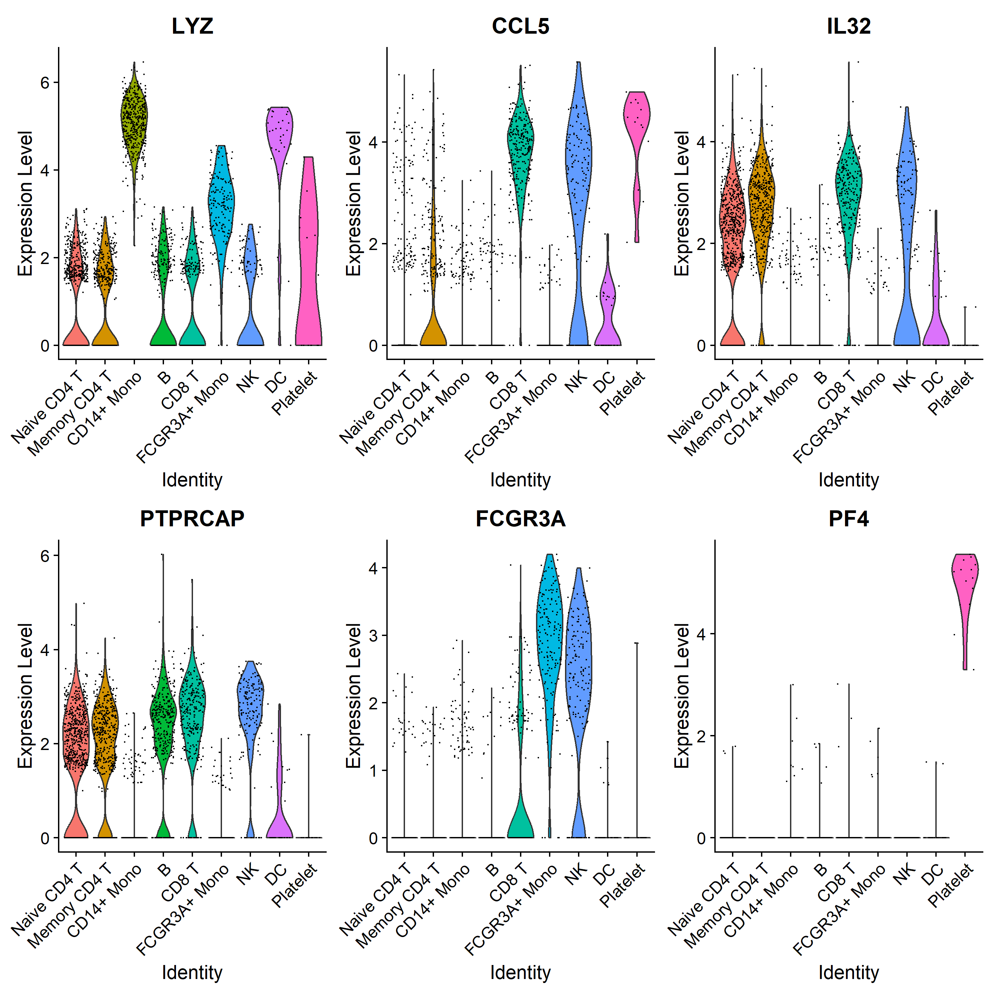

VisualizeSeurat
================
JuHyunJeon
2023-05-24

# Viusualize with Seurat

In this document, I will go through the basic workflow of Seurat but try
to explore some alternative visualization techniques that can be
employed to make graphs more readable.

## Import libraries and download data

``` r
library(tidyverse)
```

    ## ── Attaching core tidyverse packages ──────────────────────── tidyverse 2.0.0 ──
    ## ✔ dplyr     1.1.2     ✔ readr     2.1.4
    ## ✔ forcats   1.0.0     ✔ stringr   1.5.0
    ## ✔ ggplot2   3.4.2     ✔ tibble    3.2.1
    ## ✔ lubridate 1.9.2     ✔ tidyr     1.3.0
    ## ✔ purrr     1.0.1     
    ## ── Conflicts ────────────────────────────────────────── tidyverse_conflicts() ──
    ## ✖ dplyr::filter() masks stats::filter()
    ## ✖ dplyr::lag()    masks stats::lag()
    ## ℹ Use the conflicted package (<http://conflicted.r-lib.org/>) to force all conflicts to become errors

``` r
library(dplyr)
library(Seurat)
```

    ## Attaching SeuratObject

``` r
library(SeuratData)
```

    ## ── Installed datasets ───────────────────────────────────── SeuratData v0.2.2 ──
    ## ✔ ifnb   3.1.0                          ✔ pbmc3k 3.1.4
    ## 
    ## ────────────────────────────────────── Key ─────────────────────────────────────
    ## ✔ Dataset loaded successfully
    ## ❯ Dataset built with a newer version of Seurat than installed
    ## ❓ Unknown version of Seurat installed

``` r
library(ggplot2)
library(patchwork)

# I will use pbmc3k for his dtaset.
InstallData("pbmc3k")
```

    ## Warning: The following packages are already installed and will not be
    ## reinstalled: pbmc3k

``` r
data("pbmc3k.final")
pbmc3k.final$groups <- sample(c("group1", "group2"), size = ncol(pbmc3k.final), replace = TRUE)
features <- c("LYZ", "CCL5", "IL32", "PTPRCAP", "FCGR3A", "PF4")
pbmc3k.final
```

    ## An object of class Seurat 
    ## 13714 features across 2638 samples within 1 assay 
    ## Active assay: RNA (13714 features, 2000 variable features)
    ##  2 dimensional reductions calculated: pca, umap

## Ridgeline plots

The following is a sample plot from the vignette.

``` r
RidgePlot(pbmc3k.final, features = features, ncol = 2)
```

    ## Picking joint bandwidth of 0.318

    ## Picking joint bandwidth of 0.177

    ## Picking joint bandwidth of 0.161

    ## Picking joint bandwidth of 0.15

    ## Picking joint bandwidth of 0.0894

    ## Picking joint bandwidth of 0.0298

<!-- -->

However, this is not the best visualization technique for this data for
several reasons.

- There is no order to the identities.
- The plot doesn’t convey more information being a ridgeline plot.
  However, there is no clear benefit of overlapping.
  - For LYZ, we do not know the expression level shape of NK around
    expression level 3.
  - For PF4, the graph gives no information other than Platelet having
    outliers which doesn’t necessarily have to be in ridgeline plot
    format.
- Still for LYZ and CCL5, it shows a collection of distribution of gene
  expression levels.

## Violin Plot

``` r
VlnPlot(pbmc3k.final, features = features)
```

<!-- -->

- Violin plot suits the dataset better than ridgeline plot since it
  doesn’t hide any distribution.

``` r
df <- data.frame(seurat_annotations = character(), features = character(), value = numeric())
uniq_annot <- unique(pbmc3k.final$seurat_annotations)
for (annot in uniq_annot){
  pbmc.subset <- subset(pbmc3k.final, subset = seurat_annotations == annot)
  seurat_df <- GetAssayData(pbmc.subset)[features, ]
  for (f in features){
    for(i in 1:length(seurat_df[f, ])){
      df <- df %>% add_row(seurat_annotations = annot, features = f, value = seurat_df[f, i])
    }
  }
}

df$features <- factor(df$features,levels = c("LYZ", "CCL5", "IL32", "PTPRCAP", "FCGR3A", "PF4"))
```

``` r
ggplot(df, aes(x = seurat_annotations, y = value)) + geom_boxplot() + facet_wrap(~features, nrow = 2, ncol = 3) + theme(axis.text.x = element_text(angle = 45, vjust = 0.5, hjust=1))
```

<!-- -->
